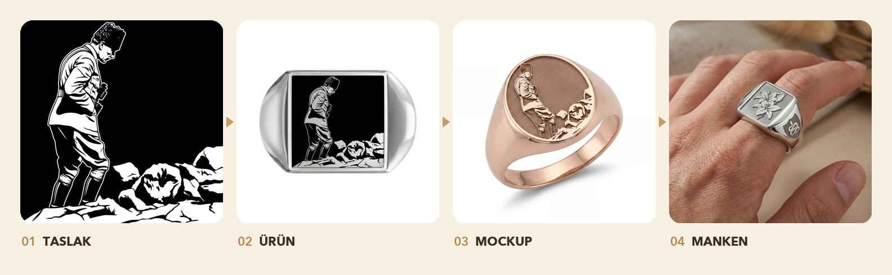
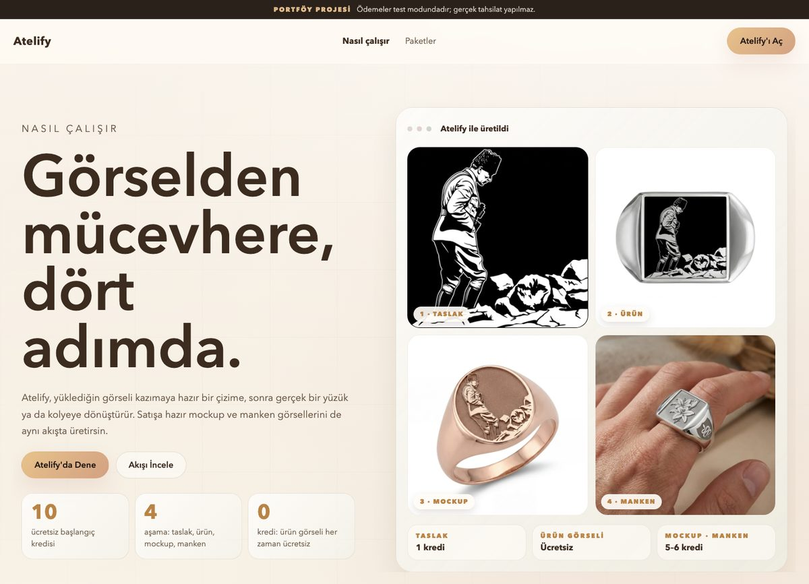
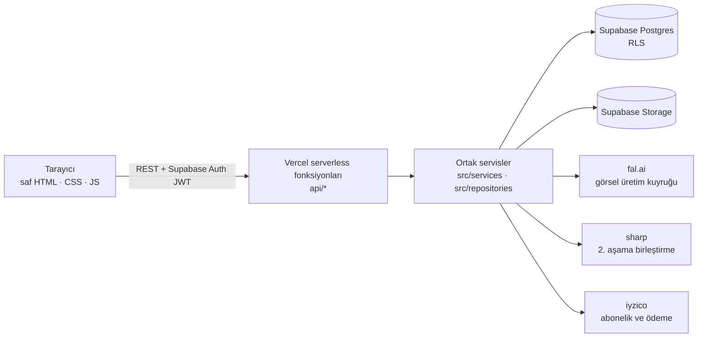
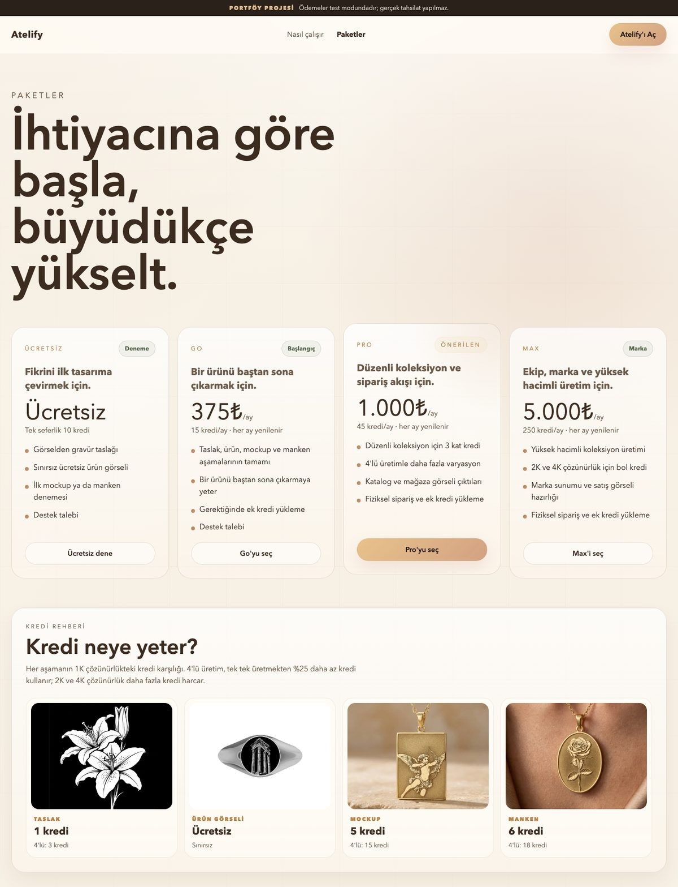

# Atelify


**Bir fotoğrafı dört adımda kişiye özel bir mücevhere dönüştürür.**

Atelify, yapay zekâ destekli bir mücevher tasarım stüdyosudur. Kullanıcı bir fotoğraf yükler (portre, logo, bina, evcil hayvan); Atelify bunu kazımaya hazır bir çizime çevirir, gerçek yüzük ve kolye kalıplarına yerleştirir, satışa hazır stüdyo ve manken fotoğrafları üretir. Kullanıcı ürünü fiziksel olarak sipariş edebilir ya da görselleri indirip kendi mağazasında kullanabilir.

[**Canlı site →**](https://atelify.aruntas.com)

> **Portföy projesi.** Ödemeler iyzico'nun test ortamında (sandbox) çalışır; gerçek tahsilat yapılmaz.

(https://github.com/user-attachments/assets/52eba11a-ba55-4a56-99ca-b0ae11d58956)



---

## Ne yapıyor

| Aşama | Ne oluyor | Nasıl | Kredi |
|---|---|---|---|
| **1 · Taslak** | Yüklenen fotoğraf siyah-beyaz bir gravür çizimine dönüşür (detaylı ya da minimalist). | Görselden görsele model (fal.ai); istemler benzerliği korumak ve yazı uydurmamak için ayarlandı. | 1 kredi |
| **2 · Ürün** | Çizim gerçek bir yüzük / kolye kalıbına oturur; kullanıcı metal, şekil ve yüzeyi seçer. | `sharp` ile deterministik birleştirme — **yapay zekâ yok**, anında ve ücretsiz. | Ücretsiz |
| **3 · Mockup** | Ürünün satışa hazır stüdyo ya da sahne fotoğrafı (Etsy, Instagram, katalog stilleri). | 2. aşama çıktısını referans alan görsel model. | 5 kredi |
| **4 · Manken** | Ürünün elde ya da boyunda görünümü. | Görsel model. | 6 kredi |

Üretim akışının etrafında eksiksiz bir ürün var:

- **Hesap ve kredi** — e-posta doğrulamalı üyelik, sunucu tarafında tutulan kredi cüzdanı ve işlem geçmişi, 10 ücretsiz kredi.
- **Abonelik ve ek kredi** — iyzico ile aylık Ücretsiz / Go / Pro / Max paketleri; abonelere tek seferlik ek kredi yükleme.
- **Fiziksel sipariş** — yüzük, kolye ve zincir için ölçü ve metale göre fiyatlanan sepet; siparişler atölye yönetim paneline düşer.
- **Tasarım arşivi** — üretilen her görsel kalıcı olarak saklanır; *Tasarımlarım* ekranında çoklu seçim ve tarayıcıda ZIP olarak toplu indirme.
- **Destek talepleri** — kullanıcı uygulama içinden talep açar ve yöneticiyle yazışır.
- **Yönetim paneli** — kredi düzenleme, yetki yönetimi, harcama özeti, sipariş ve talep takibi, kullanıcı bazlı tasarım görüntüleyici.

| Ana sayfa | Nasıl çalışır |
|---|---|
|  |  |

---

## Mimari



- **Ön yüz:** Çatısız (framework'süz) HTML/CSS/JS. Stüdyo, merkezi bir kontrolcünün (`studio.js`) etrafında küçük modüllere (`studio/`) bölünmüştür.
- **Arka uç:** Node.js (ES modules). Aynı servis katmanı (`src/`) canlıda Vercel serverless fonksiyonlarının, geliştirmede ise küçük bir yerel sunucunun (`server.mjs`) arkasında çalışır.
- **Veri:** Satır düzeyi güvenlikli (RLS) Supabase Postgres, Supabase Auth ve Storage. Şema, özel bir çalıştırıcıyla (`scripts/migrate.mjs`) uygulanan 19 sürümlü SQL migration'ında tutulur.

### Mühendislik öne çıkanları

- **Güvenilir asenkron üretim.** Görsel işleri fal.ai kuyruğuna gönderilir ve durumları sorgulanır. Kredi, gönderimden *önce* atomik olarak düşülür; iş başarısız olursa otomatik iade edilir. Her iş, istemcinin ürettiği bir kimlik ve **idempotency anahtarı** taşır; tekrar denemeler asla iki kez ücretlendirmez. Kullanıcı üretim sırasında sayfayı yenilerse kurtarma uç noktası işi tamamlar ve sonucu teslim eder.
- **Gerçek görüntü işlemeyle sıfır maliyetli aşama.** 2. aşama hiçbir model çağırmaz: gravür seçilen şekle göre maskelenir ve `sharp` ile her metal için ayrı fotoğraflanmış yüzük/kolye şablonlarının üzerine yerleştirilir.
- **Kaynağa sadakat için istem mühendisliği.** 1. aşama istemleri; kişinin benzerliğini, kamera açısını ve görünen yazıları korumak, belirsiz ayrıntıyı uydurmak yerine atlamak üzere yazıldı.
- **Ücretsiz barındırma sınırına uyum.** Vercel Hobby planı en fazla 12 serverless fonksiyona izin verir; API, dinamik rota dağıtıcılarıyla (`api/iyzico/[action].js`, `api/generation/[action].js`) 18'den 11 fonksiyona indirildi, tüm genel adresler yönlendirmelerle aynen korundu.
- **Savunmacı API.** Kullanıcı başına istek sınırlama, yükleme doğrulaması (tür, boyut, çözünürlük), kullanıcı metinleri için içerik denetimi, istek kimlikli yapısal JSON loglama, isteğe bağlı Sentry ve `/api/health` uç noktası.
- **Zarif bozulma.** Görsel sağlayıcısı kullanılamadığında (örneğin bakiye bittiğinde) kullanıcı ham bir hata yerine "üretim geçici olarak kapalı" mesajı görür ve kredisi iade edilir.



---

## Teknolojiler

| Alan | Araçlar |
|---|---|
| Ön yüz | HTML, CSS, saf JavaScript |
| Arka uç | Node.js 20+ (ESM), Vercel serverless fonksiyonları |
| Veritabanı ve kimlik | Supabase (Postgres, Row Level Security, Auth, Storage) |
| Görsel üretim | fal.ai (`nano-banana-pro/edit`) |
| Görüntü işleme | sharp |
| Ödeme | iyzico (abonelik, ödeme formu, sandbox) |
| Test | Vitest — 23 dosyada 172 test |
| İzleme | Yapısal loglama, istek kimlikleri, isteğe bağlı Sentry |

---

## Proje yapısı

```
api/                 Vercel serverless fonksiyonları (11) — ince HTTP katmanı
  iyzico/[action].js   ödeme, geri dönüş, ek kredi (tek dağıtıcı)
  generation/[action].js  durum, teslim, kurtarma (tek dağıtıcı)
  admin/[resource].js  yönetim uç noktaları (tek dağıtıcı)
src/
  services/          iş mantığı: üretim, kredi, 2. aşama birleştirme, ödeme, sipariş…
  repositories/      Supabase veri erişimi
  providers/         fal.ai ve iyzico istemcileri, istem oluşturucular
  lib/               loglama, istek sınırlama, doğrulama, içerik denetimi, hata sınırı
  config/            ortam ayarları, paketler, fiyatlar
studio/              stüdyo ön yüz modülleri (ekranlar, store, servisler, yardımcılar)
supabase/migrations/ sürümlü SQL şeması (0001 → 0018)
scripts/             migration çalıştırıcı ve kurulum betikleri
tests/               Vitest birim testleri
server.mjs           yerel geliştirme sunucusu
```

---

## Yerelde çalıştırma

Gerekenler: Node.js 20+, bir Supabase projesi ve (isteğe bağlı) fal.ai ve iyzico sandbox anahtarları.

```bash
npm install
cp .env.example .env      # Supabase, fal.ai ve iyzico sandbox değerlerini doldur
npm run migrate           # SQL migration'larını uygula (SUPABASE_DB_URL gerekir)
npm run dev               # http://localhost:3000
npm test                  # testleri çalıştır
```

`localhost` üzerinde stüdyo **test modunda** çalışır: üretim butonları ücretli görsel API'sini çağırmadan örnek sonuç döndürür, böylece akışın tamamı ücretsiz gezilebilir.

Önemli ortam değişkenleri (tam liste `.env.example` içinde):

| Değişken | Amaç |
|---|---|
| `SUPABASE_URL`, `SUPABASE_PUBLISHABLE_KEY`, `SUPABASE_SERVICE_ROLE_KEY` | Veritabanı, kimlik ve depolama |
| `FF_PUBLIC_SITE_URL` | Doğrulama e-postaları ve ödeme dönüşlerinde kullanılan site adresi |
| `FAL_KEY` | Görsel üretim |
| `IYZICO_API_KEY`, `IYZICO_SECRET_KEY`, `IYZICO_BASE_URL` | Ödeme (varsayılan: sandbox) |
| `FF_ADMIN_EMAILS` / `FF_ADMIN_USER_IDS` | Yönetici yetkisi olan hesaplar |

---

## Durum

Atelify, yayında olan eksiksiz bir portföy projesidir. Ödemeler test modundadır; canlı görsel üretim, görsel sağlayıcısındaki bakiyeye bağlıdır. Üretim kapalıyken site bunu açıkça söyler ve kredi düşülmez.
